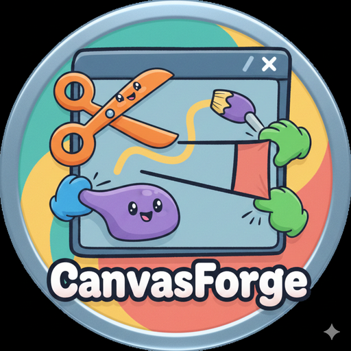
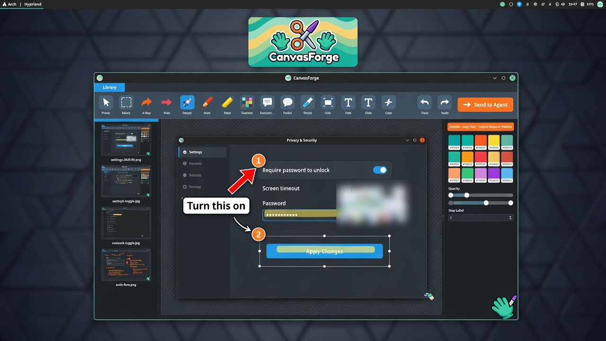
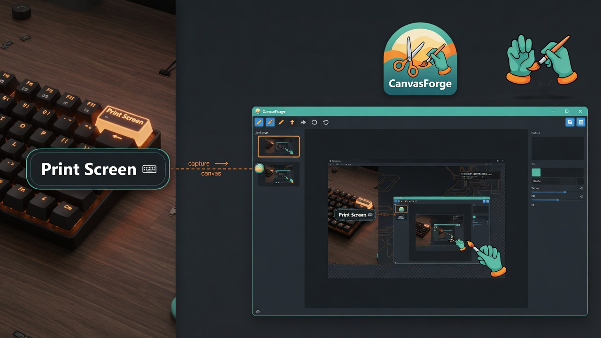
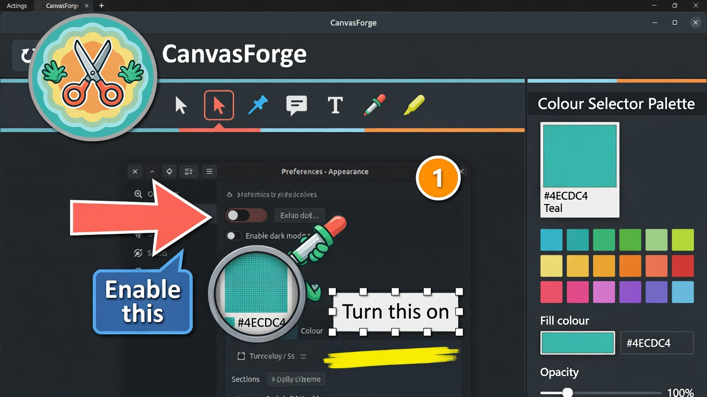
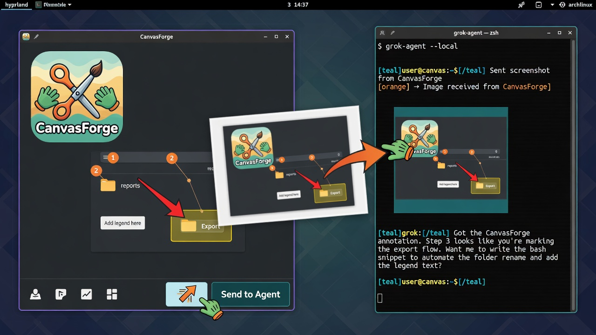

<p align="center">
  
</p>

<h1 align="center">CanvasForge</h1>

<p align="center">
  <strong>The polished screenshot annotation canvas for Omarchy Arch Linux + Hyprland.</strong>
</p>

<p align="center">
  <a href="https://github.com/lukejmorrison/canvasforge/releases"></a>
  <a href="https://aur.archlinux.org/packages/canvasforge-beta"></a>
  <a href="LICENSE"></a>
</p>

<p align="center">
  Native desktop app. Install it on your machine and it runs locally — not a website, not a hosted web app.
</p>

<p align="center">
  <a href="https://aur.archlinux.org/packages/canvasforge-beta"></a>
  <a href="https://github.com/lukejmorrison/canvasforge/releases/tag/v0.6.0-beta.12"></a>
  <a href="ROADMAP.md"></a>
</p>

<p align="center">
  <a href="https://aur.archlinux.org/packages/canvasforge-beta">AUR package</a>
  ·
  <a href="https://github.com/lukejmorrison/canvasforge/releases">All GitHub releases</a>
  ·
  <a href="https://github.com/lukejmorrison/canvasforge/releases/tag/v0.6.0-beta.12">Latest tarball</a>
  ·
  <a href="https://github.com/lukejmorrison/canvasforge/releases/download/v0.6.0-beta.12/CanvasForge-0.6.0-beta.12-macos-x64.dmg">macOS Intel DMG</a>
  ·
  <a href="CONTRIBUTING.md">Contributing</a>
  ·
  <a href="https://github.com/lukejmorrison/canvasforge/discussions">Discussions</a>
</p>

<p align="center">
  
</p>

A fast PyQt6 canvas for turning raw screenshots into documentation-ready visuals. It shines on **Omarchy**: first-class screenshot editor, scratchpad citizen, and Grok TUI companion.

## How it works

Product shots below were generated with **Grok Imagine**. They show the workflow; the installed app is the real UI.

### 1. Press Print Screen

The capture lands on a monitor-accurate canvas. On Omarchy, set `OMARCHY_SCREENSHOT_EDITOR=canvasforge` and Print Screen opens CanvasForge.

<p align="center">
  
</p>

### 2. Annotate

Arrows, numbered steps, callouts, text boxes, highlight, blur, eyedropper, and the Colour Selector Palette. Pointer and Move treat text like any other object.

<p align="center">
  
</p>

### 3. Send to Agent

One click flattens a clean JPEG for Grok, Claude, Codex, or OpenClaw — clipboard, folder, or command. No website in the middle.

<p align="center">
  
</p>

## Omarchy integration

- **Print Screen → CanvasForge** — Set `OMARCHY_SCREENSHOT_EDITOR=canvasforge` and every screenshot opens with the correct monitor resolution.
- **Super + S Scratchpad** — Enable "Launch in Omarchy Scratchpad" in Preferences. CanvasForge appears on whatever monitor your mouse is on.
- **Monitor-accurate canvas** — Uses physical monitor resolution (including fractional scaling like `scale 1.2`).
- **Grok TUI** — **Send to Agent → Clipboard (base64 JPEG)** pastes a clean, sized image into Grok.
- **HiDPI** — Proper support for high-DPI and scaled Omarchy displays.

See the [full Omarchy setup guide](#omarchy-setup) below.

## Install packages

Click **Releases** in the GitHub sidebar for the same list. Ready assets download; the others are placeholders until that OS ships ([roadmap](ROADMAP.md)).

| OS | Status | Release link |
|----|--------|----------------|
| **Linux / Arch / Omarchy** | Ready | [AUR `canvasforge-beta`](https://aur.archlinux.org/packages/canvasforge-beta) |
| **Linux source tarball** | Ready | [canvasforge-0.6.0-beta.12.tar.gz](https://github.com/lukejmorrison/canvasforge/releases/download/v0.6.0-beta.12/canvasforge-0.6.0-beta.12.tar.gz) |
| **Linux AppImage** | Placeholder | [PLACEHOLDER-linux-x86_64.AppImage.txt](https://github.com/lukejmorrison/canvasforge/releases/download/v0.6.0-beta.12/PLACEHOLDER-linux-x86_64.AppImage.txt) |
| **Windows x64** | Placeholder | [PLACEHOLDER-windows-x64-setup.txt](https://github.com/lukejmorrison/canvasforge/releases/download/v0.6.0-beta.12/PLACEHOLDER-windows-x64-setup.txt) |
| **macOS Apple Silicon** | Placeholder | [PLACEHOLDER-macos-arm64.dmg.txt](https://github.com/lukejmorrison/canvasforge/releases/download/v0.6.0-beta.12/PLACEHOLDER-macos-arm64.dmg.txt) |
| **macOS Intel** | Ready | [CanvasForge-0.6.0-beta.12-macos-x64.dmg](https://github.com/lukejmorrison/canvasforge/releases/download/v0.6.0-beta.12/CanvasForge-0.6.0-beta.12-macos-x64.dmg) |
| **Android** | Placeholder | [PLACEHOLDER-android.apk.txt](https://github.com/lukejmorrison/canvasforge/releases/download/v0.6.0-beta.12/PLACEHOLDER-android.apk.txt) |
| **iOS** | Placeholder | [PLACEHOLDER-ios.ipa.txt](https://github.com/lukejmorrison/canvasforge/releases/download/v0.6.0-beta.12/PLACEHOLDER-ios.ipa.txt) |
| **All releases** | | [github.com/lukejmorrison/canvasforge/releases](https://github.com/lukejmorrison/canvasforge/releases) |

Omarchy / Arch (press Enter at every prompt):

```bash
yay -S canvasforge-beta
```

Do **not** use `yay -Syu canvasforge-beta` unless you intend a full system upgrade.

## Features

- **Screenshot Editor for Omarchy** — Deep integration as a Print Screen replacement with monitor-accurate canvases and scratchpad support.
- **Powerful Annotation Tools** — Arrows, callouts, steps, blur, highlight, borders, text, and vector shapes with live previews.
- **Smart Selection & Cutouts** — Draw regions on images, move them around, or extract them cleanly.
- **Colour Picker + Fill** — Pick colours from the canvas or Omarchy `hyprpicker`, then bucket-fill connected raster-image regions with undo and transparent fill support.
- **Layer & Repository System** — Full layer management + a persistent image library that watches your Screenshots folder.
- **One-Click Agent Handoff** — Send to Claude, Codex, OpenClaw, Wizwam, or directly to Grok TUI via clean clipboard JPEG.
- **Flawless Export** — Flatten selected or all layers with hidden handles for pixel-perfect output.
- **Beautiful Theming** — Multiple icon themes, dark mode, and fully customizable toolbar.
- **HiDPI & Fractional Scaling** — Excellent support for modern displays with non-integer scaling (common in Omarchy).

## Getting Started

### Omarchy / Arch Linux (Recommended)

Install **only** the CanvasForge AUR package (this does not upgrade the rest of your system):

```bash
yay -S canvasforge-beta
```

Or from a checkout:

```bash
bash scripts/install_canvasforge.sh
```

**Press Enter at every prompt** to accept the defaults. You may be asked for your sudo password once.

Do **not** use `yay -Syu canvasforge-beta` unless you intend a full system upgrade (that can rebuild unrelated packages such as gcc).

Then press **Print Screen**. CanvasForge will handle the rest.

See the [full Omarchy setup](#omarchy-setup) below for scratchpad + multi-monitor configuration.

### macOS Intel

Download the Intel x86_64 DMG from GitHub Releases. You need an **Intel Mac** and **macOS 11 or later** (verified on Monterey 12.7.6). There is **no Apple Silicon DMG** yet.

1. Download [CanvasForge-0.6.0-beta.12-macos-x64.dmg](https://github.com/lukejmorrison/canvasforge/releases/download/v0.6.0-beta.12/CanvasForge-0.6.0-beta.12-macos-x64.dmg) from the [v0.6.0-beta.12](https://github.com/lukejmorrison/canvasforge/releases/tag/v0.6.0-beta.12) release.
2. Open the DMG and drag **CanvasForge** to **Applications**.
3. First launch may need **right-click → Open**. The app is ad-hoc signed (no Developer ID).
4. If you use capture, macOS may ask for **Screen Recording** and **Accessibility**.

This Intel build includes a Monterey launch fix for leftover Saved Application State (late `NSApplicationDelegate`).

### Other Systems

**Flatpak**
```bash
bash scripts/build_flatpak.sh
flatpak run com.lukejmorrison.CanvasForge
```

**Local Install (any Linux)**
```bash
bash scripts/install_canvasforge.sh --local
canvasforge
```

**From Source**
```bash
git clone https://github.com/lukejmorrison/canvasforge.git
cd canvasforge
python -m venv .venv && source .venv/bin/activate
pip install -r requirements.txt
python main.py
```

### Other Distributions

**Flatpak**
```bash
bash scripts/build_flatpak.sh
flatpak run com.lukejmorrison.CanvasForge
```

**Local Install**
```bash
bash scripts/install_canvasforge.sh --local
```

The installer is robust and works well on Pop!_OS, Fedora, and other distributions.

```bash
# Arch/Omarchy: AUR package canvasforge-beta only (press Enter at prompts)
# Other distros: clone from GitHub into a venv
bash scripts/install_canvasforge.sh

# Full venv reinstall (non-Arch, or with --local)
bash scripts/install_canvasforge.sh --clean

# Developer install from your current local checkout (venv, not AUR)
bash scripts/install_canvasforge.sh --local

# Full reinstall from your current local checkout
bash scripts/install_canvasforge.sh --local --clean

# Show installer options
bash scripts/install_canvasforge.sh --help
```

On Omarchy/Arch, `scripts/install_canvasforge.sh` installs only `canvasforge-beta` from AUR. On other distributions it uses a venv and auto-heals unhealthy environments.

## Usage Notes

- Use the toolbar or keyboard shortcuts (`S` for select) to switch tools. Select supports click, Ctrl/Cmd-click toggles, Ctrl/Cmd+A select-all, and marquee selection that stays in sync with the layer list.
- With the **Select** tool, draw a marquee on a raster image, then drag with the hand cursor to clip the region out. Release near the original hole to snap it back perfectly; release elsewhere to keep a new clipped layer (undoable). Escape cancels a lift.
- Use **Eyedropper** (`I`) to choose the active fill colour with the canvas picker preview, then **Fill** (`F`) to bucket-fill a connected area inside a raster image layer. Hold Alt while clicking Eyedropper to use Omarchy's `hyprpicker` screen picker instead.
- Use the right-side **Details - [Tool] Tool - Colour Selector Pallet** panel above Repository to pick Fill colours from swatches, choose a custom alpha-aware colour, or select Transparent for cutaway fills.
- Use the **View** menu for zoom in/out, zoom to fit, actual size, shrink-to-fit, pixel grid, background color, sidebar visibility, and quick focus actions for Details, Library, and Recent Captures.
- Enable **Edit → Preferences → Canvas → Zoom with Scroll Wheel** for Photoshop-style wheel zoom at the cursor. Turn it off to use Photoshop's stock wheel behavior: wheel pans vertically, Alt+wheel zooms. The same Canvas preferences also expose Animated Zoom and sensitivity controls for smoother wheel flicks.
- Alt-drag canvas edges or corners to snap the workspace to common X.com, social, video, web, and connected-monitor sizes. The resize badge names the snapped preset, and the tag below the canvas shows resolution, aspect ratio, PNG type, and transparency status.
- The **Image Library** panel on the left auto-scans `~/Pictures/Screenshots` (with fallbacks) for PNG/JPG/WebP/GIF/SVG files. Double-click or drag thumbnails onto the canvas, use the zoom slider for larger previews, and tap *Export Canvas* to flatten the scene back into the monitored folder.
- Switch the watched folder any time via **Edit → Change Image Library Folder...**. CanvasForge stores the selection in `QSettings` so it persists between launches, and the combo box in the panel remembers common screenshot directories.
- Paste content from the clipboard (Ctrl/Cmd+V). SVG markup from the clipboard remains editable; bitmap content becomes raster layers.
- Right-click anywhere on an item to open the shared context menu for copy/delete and future actions.
- Drag resize handles with standard modifiers: no key keeps proportions, Shift/Ctrl allows independent width/height, Alt resizes from center, Ctrl+Shift skews where supported, and Ctrl+Alt+Shift applies perspective-style transforms where supported.
- Use *Flatten Selected* or *Flatten All* from the toolbar/menu to rasterize layers. The operations create a new raster artifact without destroying originals until you remove them.
- Saving (`Ctrl/Cmd+S`) renders the scene without showing selection handles and writes a PNG to your default Pictures/CanvasForge directory. Change this directory via **Edit → Settings → Save Directory**; CanvasForge persists the choice using `QSettings`.
- Use *Save Selected* (`Ctrl+Alt+S`) to write just the selected layers. Use *Send to Agent* (`Ctrl+Shift+A`) to create a temp bundle with `selected.png` and `annotations.json`; configure the command, VS Code Codex folder handoff, HTTP endpoint, Clipboard image-path handoff, or Clipboard base64 JPEG handoff under **Edit → Preferences → Agent**. The base64 JPEG handoff targets Grok-friendly defaults: longest side 1440px, quality 88.

## Omarchy Setup (Recommended)

CanvasForge is built to feel at home on **Omarchy Arch Linux**.

### 1. Set as Default Screenshot Editor

```bash
# One-time
OMARCHY_SCREENSHOT_EDITOR=canvasforge omarchy capture screenshot

# Permanent (recommended)
echo 'OMARCHY_SCREENSHOT_EDITOR=canvasforge' > ~/.config/environment.d/omarchy-screenshot.conf
```

Or use the dedicated flag for scripts and agents:

```bash
canvasforge --screenshot-editor /path/to/screenshot.png
```

### 2. Enable Scratchpad Mode (Power User Favorite)

1. In CanvasForge go to **Preferences → Canvas → Screenshot Editor**
2. Check **"Launch screenshot editor in Omarchy Scratchpad"**
3. In **Window → Startup Behavior**, select **"Open on Screen with Mouse"**

Add these lines to your Hyprland config:

```hyprland
# Toggle CanvasForge
bind = SUPER, S, togglespecialworkspace, canvasforge

# Rules
windowrulev2 = workspace special:canvasforge, class:^(CanvasForge)$
windowrulev2 = float, class:^(CanvasForge)$
windowrulev2 = size 80% 80%, class:^(CanvasForge)$
```

Now **Print Screen** sends the capture to your scratchpad. Press **Super + S** and CanvasForge appears on whatever monitor your mouse is on, with a perfectly sized canvas.

### 3. Monitor Resolution & Scaling

CanvasForge automatically uses your monitor’s **physical** resolution (correctly handles `scale 1.2`, `1.6`, etc.). You can also force a specific monitor in Preferences.

See the full list of options in **Preferences → Canvas → Screenshot Editor**.

**Advanced / AI Agent Usage**

You can force screenshot editor mode with a dedicated flag:

```bash
canvasforge --screenshot-editor /path/to/screenshot.png
```

This is useful for scripts, Omarchy hooks, or AI agents.

In **Preferences → Canvas → Screenshot Editor**, you can also enable:
- "Launch screenshot editor in Omarchy Scratchpad" (hides the window until you press your toggle key)
- Choose which monitor's resolution to use for the canvas

This makes `Super + S` (scratchpad toggle) bring up CanvasForge on the monitor your mouse is currently on.

## Project Layout

- `main.py` – Entire PyQt6 application, including the custom `CanvasView`, item classes, selection overlay, flatten/save helpers, and menu/toolbar wiring.
- `assets/toolbar_icons/` – Toolbar icon PNGs.
- `artifacts/` – Sample vector callouts bundled for quick use.
- `packaging/aur/canvasforge-beta/` – AUR beta package recipe and release checklist.
- `requirements.txt` – Runtime dependencies (currently only PyQt6).
- [`ROADMAP.md`](ROADMAP.md) – Platform roadmap (desktop packages, mobile companion).
- [`TODO.md`](TODO.md) – Issue index (GitHub Issues are the working backlog).
- [`CONTRIBUTING.md`](CONTRIBUTING.md) – Discussions, Issues, and pull requests.
- [`docs/github-workflow.md`](docs/github-workflow.md) – Issue → implement → test → ship.
- [`docs/pwa-platform-plan.md`](docs/pwa-platform-plan.md) – Native packages and mobile companion (not a hosted PWA).
- [`docs/targets.md`](docs/targets.md) – What to build locally vs on CI.
- [`docs/images/`](docs/images/) – README product shots (Grok Imagine).
- [`docs/releases/placeholders/`](docs/releases/placeholders/) – Per-OS GitHub Release placeholder assets.

## Roadmap

CanvasForge stays a native app: one repo, one version, native packages per OS. The desktop editor remains PyQt6. A phone app, when it exists, is a companion that sends captures to the desktop — not a rewrite and not a hosted site.

| Phase | Focus | Status |
|-------|--------|--------|
| Now | AUR, Flatpak, macOS Intel DMG | Ships today |
| 1 | Windows installer, macOS Apple Silicon, AppImage, multi-asset Releases | Help wanted |
| 2 | Android companion + QR pairing on LAN / Tailscale | Later |
| 3 | iOS, optional stores (winget, Homebrew, Flathub) | Last |

Full sequence, non-goals, and how to help: **[ROADMAP.md](ROADMAP.md)**.

## Contributing

Please read **[CONTRIBUTING.md](CONTRIBUTING.md)** before you open a pull request.

- **Open-ended ideas, questions, and packaging help** go in [Discussions](https://github.com/lukejmorrison/canvasforge/discussions).
- **Bugs and accepted product work** go in [Issues](https://github.com/lukejmorrison/canvasforge/issues) ([TODO.md](TODO.md) is an index).
- **Code** is a pull request linked to an Issue (tiny docs fixes may link a Discussion). See [docs/github-workflow.md](docs/github-workflow.md).

Keep screenshots, `pasted_logs/`, and `wizwam-code-review/` out of commits. Update [CHANGELOG.md](CHANGELOG.md) for user-facing changes.
